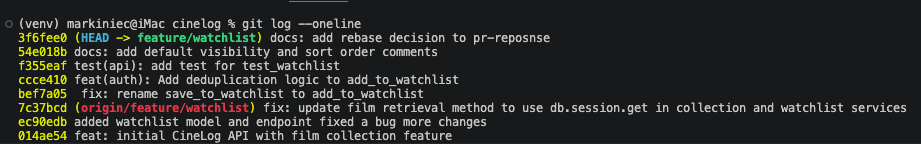

## AI Usage 
<!-- Fill in at the end - how AI tools were used during the project -->
used Claude Code  in to understanding the logic for add_to_collection, collection of services, models, a test_collections \
used Claude Code for counter argument for commnet 4 n 5. received the suggest to change the default to False in models.py and change from aphebeical order to date first in get_watchlist() in watchlist_service.py
## Commit 1 - Rename 
**What I did:**

Searched services folder and navigated to the file watchlist_services.py. From there, found the function save_to_watchlist() and changed to add_to_watchlist(). Also changed all occurrences of the function save_to_watchlist, particular in the routes folder within the file watchlist.py. 

**How I verified:**

Utilized the editor's find-all-references to ensure all changes were made the function save_to_watchlist to add_to_watchlist.

## Comment 2 - Deduplication
**What I did:**

Navigated to the watchlist_service.py with in the services folder. Inside the add_to_watchlist(), deduplication logic was created to ensure a watch list was not duplicated. The newly added error, AlreadyInWatchListError, would be raised if a film was added to the list and it already existed.

**How I verified**

The logic was verified by test_watchlist.py in the folder tests. Test ran: 
> pytest tests/test_watchlist.py -v

## Comment 3 - Missing test
**What I did**
 Navigated to services and reviewed collection_service.py. Created a test for test_watchlist.py and used test_collection.py as a model for the test. 

**How I verified**

The logic was verified by test_watchlist.py in the folder tests. Test ran: 
> pytest tests/test_watchlist.py -v

## Comment 4 - Default visibility 

**My position**

My position is public should be set to False. 

**Reasoning**

Although a user's watch list being set as public=True, allows for sharing of film ratings for other users, it does present a risks factor. Often a community receive suggestions from within, such as Reddit, Facebook, etc. This optimize the approach of sharing allowing the system to grow and be utilized by newbies and film buffs alike. This only works it the user can decide to share and given the choice to do so. 

**Tradeoff acknowledged**

The trade off of course would be keeping watchlists set to public=True. Although not an opposite of public=False, the trade-off would be to provide users with no say in how collections, ratings, and watchlist is shared among the community. By doing so, would possible divide the community and would stifle the growth of Cinelog. Users participate in the film tracking app to share movies viewed, rated, and collected with some form of user control. 

## Comment 5 - Sort order 
**My position:**

I whole hearty agree with your preference for watchlists to be defaulted to date added vs adding films alphabetically. 

**Reasoning:**

Accessing the most recent data is often easier than recall. A user may not remember the last film seen or the title of the film. If a film rating was low, the user may not recall it was low and spend time searching for it, only to see the film had a low rating. 

**Engagement with reviewer's point:**
 
 From my experience, most users, on any platform, like to be able to access the most recent items first. Anything added recently would want to be seen by the user. Therefore I do agree. 

## Comment 6 - Rebase 
**What conflicted:**

Reference to integer IDs and not UUID in watchlist code. 

**How I resolved it:**

resolved the conflict by updating watchlist code using UUIDs where it still referenced integer IDs.

**How I verified no conflict remains:**
 
 Verified no conflict remains by reviewing git status.

## PR Description 

<!-- Written at the end — feature overview, design decisions, manual testing steps -->
